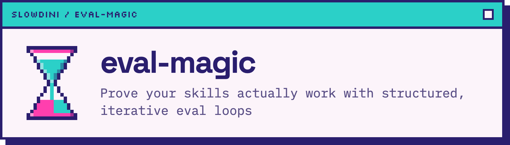

<p align="center">
  
</p>

<p align="center">
  <a href="https://github.com/slowdini/eval-magic/actions/workflows/ci.yml"></a>
  <a href="https://app.codecov.io/gh/slowdini/eval-magic"></a>
  <a href="https://github.com/slowdini/eval-magic/releases/latest"></a>
  <a href="https://crates.io/crates/eval-magic"></a>
  <a href="./LICENSE"></a>
</p>

# eval-magic

**A CLI for measuring whether an agent skill changes behavior.**

eval-magic runs the same task in two controlled conditions—such as a new skill versus no skill, or
an edited skill versus its previous version—and grades both results against shared assertions. It
builds isolated task workspaces, stages skills, dispatches the agent sessions itself, ingests
transcripts and final state, and produces comparison artifacts. It drives Claude Code, Cline,
Codex, OpenCode, or a descriptor-backed harness of your own.

The installed CLI is the primary manual. Start with `eval-magic --help`, and use
`eval-magic <command> --help` whenever you reach a new phase.

## Install

eval-magic supports Linux and macOS. On Windows, install and run eval-magic inside Windows
Subsystem for Linux (WSL); native Windows is unsupported. Keep the repository, workspace, and
harness commands inside the same WSL environment.

Git and a POSIX shell are required. Set `EVAL_MAGIC_SH` to select a specific `sh`.

Prebuilt binaries for macOS and Linux are attached to each
[GitHub release](https://github.com/slowdini/eval-magic/releases).

Install on macOS, Linux, or inside WSL:

```bash
curl --proto '=https' --tlsv1.2 -LsSf \
  https://github.com/slowdini/eval-magic/releases/latest/download/eval-magic-installer.sh | sh
```

Or build and install from crates.io:

```bash
cargo install eval-magic
```

Confirm the installation with `eval-magic --version`.

## Quickstart

Start in a skill directory containing `SKILL.md`:

```bash
cd path/to/my-skill
eval-magic init
```

`init` creates `evals/evals.json` with one valid seed case and the pinned Weeknight example
codebase. Use `eval-magic init --help` to select another URL, local path, or the current directory,
and use `eval-magic docs codebase` for fixture selection and provenance details. Edit the prompt
and expected behavior to describe a realistic task, add concrete assertions as the eval matures,
then check the file:

```bash
eval-magic validate
```

Prepare the first comparison with the default Claude Code harness:

```bash
eval-magic run
```

Or select another registered harness:

```bash
eval-magic run --harness cline
eval-magic run --harness codex
eval-magic run --harness opencode
```

`run` prepares the campaign; `eval-magic dispatch` runs it. Review the printed task and model-usage
summary before continuing — dispatch is where model usage is spent. Then read the generated
`RUNBOOK.md` from beginning to end. It contains the exact dispatch, ingest, judge, finalize, and
`eval-magic teardown` commands for that campaign and harness.

After finalization, open the generated `benchmark.json` to compare pass rates, token and duration
measurements, and validity warnings. Use `eval-magic aggregate --help` when you need to combine
multiple campaigns.

To evaluate an edit already in your working tree, snapshot the committed version and compare it
with the edited file:

```bash
eval-magic snapshot --label baseline --ref HEAD
eval-magic run --mode revision
```

The command help and generated runbook describe baseline selection and the rest of the workflow.

An eval can treat coordinated skills as one treatment by setting `skill_name` to an ordered list.
Pass one listed member with `--skill`; it remains the eval owner and supplies fixtures. See
`eval-magic docs isolation` for the complete configuration, Mode A/B behavior, and provenance.

## How it works

Each eval case runs once per condition and repetition in its own clean Git repository. The two arms
receive the same task and fixtures; only the condition under test changes. Assertions can combine
LLM judgment with runner-owned command checks, transcript checks, and final diff limits. Scripted
Multi-turn evals resume one native harness session so follow-up answers remain part of the same
conversation, whether the turns are scripted or derived by a responder (`eval-magic docs
conversations`).

Most harness features are declared in TOML descriptors. See the current registry and resolved data
instead of relying on a static compatibility table:

```bash
eval-magic harness list
eval-magic harness show codex
```

## Documentation and contributing

- `eval-magic --help` and subcommand help cover the complete CLI workflow and every flag.
- `eval-magic docs` lists the offline, version-matched guides embedded in the binary.
- `eval-magic docs byoh` explains descriptor authoring, testing, layering, and contribution. Its
  repository source is [docs/guides/byoh.md](docs/guides/byoh.md).
- `eval-magic docs isolation` explains how live or installed skill sources can contaminate a
  comparison and how to verify isolation. Its source is
  [docs/guides/isolation.md](docs/guides/isolation.md).
- `eval-magic docs guard` explains eval-authored command allowances, packaged defaults, and the
  containment checks those allowances cannot bypass. Its source is
  [docs/guides/guard.md](docs/guides/guard.md).
- [docs/developer_overview.md](docs/developer_overview.md) maps the codebase, sources of truth,
  verification workflow, and internal documentation.

Issues and planned work are tracked in the
[GitHub issue tracker](https://github.com/slowdini/eval-magic/issues).

## Development

Development carries the same host requirement as use: Linux or macOS with a POSIX shell. On
Windows, clone the repository and run the complete toolchain inside WSL; native Windows development
is unsupported. The dispatch tests spawn `#!/bin/sh` harness stubs through the resolved shell and
do not skip, so the suite cannot pass without one. Tests that need symlink creation report a skip
instead.

```bash
cargo fmt --check
cargo build
cargo test
cargo clippy --all-targets -- -D warnings
```

See [AGENTS.md](AGENTS.md) for repository conventions.

## License

MIT
